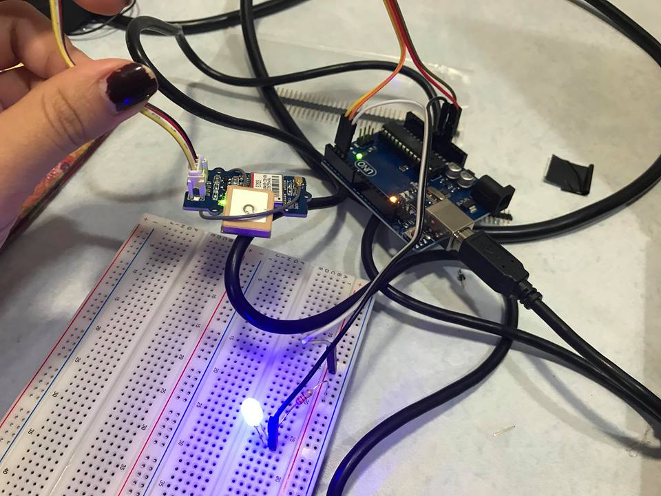

# GPS_detach
Case file #002: GPS sensor reading &amp; balloon detach based on condition @NTUAS

## Description
Locate position (longitude & latitude) of weather observation module.  
Detach balloon when module reaches certain position or region. 

## Materials

### Arduino UNO
### Seeed grove GPS module
- Communication protocol UART.  
### Relay & detaching device 
- Relay: given high voltage with digital signal from Arduino.  
- Detach device: Temporarily respresented with fuse on the wiring diagram.  

## Wiring

## Demo
Represent detach device with LED.  
Give off high voltage signal when reaching certain displacement.  

